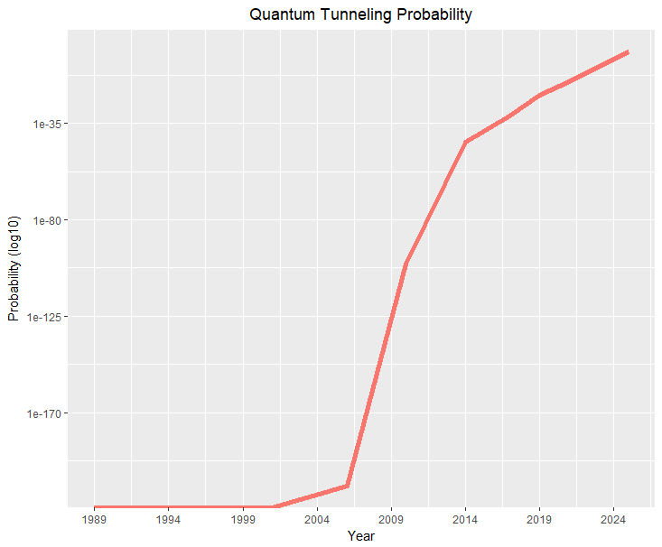

Quantum Tunneling
=================

## Synopsis

This document is an analysis of the probabilities of quantum tunneling to occur at various semiconductor barrier sizes with consideration for the current manufactoring process.

The analaysis includes a select data-set of 9 examples by year and semiconductor barrier size. The results of the analysis demonstrate insignificant effects from quantum tunneling for recent years. However, a significant increase in quantum tunneling probability within semiconductors begins to appear at year 2025.

## Background

Quantum tunneling is the process by which a tiny particle can pass through a solid barrier given certain conditions. Examples of particles that can exhibit this effect include electrons and photons.

The quantum tunneling effect manifests itself within a quantum system at the microscopic scale. This is generally considered within the range of nanometers. While the macroscopic world that we can see and feel around us behaves in traditionally expected ways according to the laws of classical physics, the microscopic world behaves much differently. Specifically, quantum physics demonstrates profound effects including entangelement, teleportation, and tunneling.

Since an electron travelling through and beyond a semiconductor barrier could result in data loss of the corresponding bit, this process will become increasingly important to computing as technology continues its advancement towards minituraized components. Beyond a certain level of miniaturization, computing components will begin to exhibit quantum effects, resulting in the probability of an electron tunneling through a barrier within a transistor becoming increasingly more probable.

As a result, future computing technology may experience increased probabilities for data loss, potentially rendering transisitor-based computing devices obsolete. Given the steady progress of component miniturization, it is possible to begin seeing the effects of quantum tunneling on traditional computers within the next 10 years.

## Quantum Tunneling Requirements

In order for quantum tunneling to occur, a system must contain a tiny sized particle, such as an electron, along with a solid barrier. Additionally, the following requirements must exist.

1. The barrier must be relatively thin and contain a specific finite height in size.
2. The barrier's potential energy (V) must exceed the kinetic energy of the particle (E).
3. The particle to pass through the barrier must be a quantum sized particle, such as an electron, photon, or other tiny particle at the nanoscale.

## Data Set

The data source for this analysis consists of a select set of years and semiconductor barrier sizes for the current manufactoring process. Using this data, we can calculate the probabilities for quantum tunneling to occur by using Engel's probability function.

```{r, echo=F}
data <- data.frame(list(year = c(1989, 2001, 2006, 2010, 2014, 2017, 2019, 2021, 2025),
                        size = c(0.000008, 1.30e-7, 0.000000065, 0.000000032, 0.000000014, 1e-8, 7e-9, 5e-9, 5e-10)))
```

## Engel's Quantum Tunneling Probability Function

The probability for a particle to exhibit quantum tunneling through a solid barrier can be calculated using the formula below.

```{r}
engel <- function(a, V, E) {
  # a = thickness of the barrier
  # V = potential energy of the barrier
  # E = kinetic energy of the electron
  # 6.626e-34 = the Plank constant
  # 1.6e-19 = 1 electron volt converted to joules
  # 9.1e-31 = mass of an electron
  exp(((-4 * a * pi) / 6.626e-34) * sqrt(2 * 9.1e-31 * ((V - E) * 1.6e-19)))
}
```

## Summary of Results

We can now compute the quantum tunneling probabilites for an electron with the following characteristics.

```{r}
E <- 4.5
V <- 5

prob <- data.frame(Year=data$year, 'Barrier Size'=data$size, Probability=engel(data$size, V, E))
prob
```

A plot of the probabilities for quantum tunneling occurring at various semiconductor barrier sizes is shown below.

```{r, echo=F}
g <- ggplot(data = data, aes(x = prob$Year, y = prob$Probability, colour='red'))
g <- g + geom_line(size=2, show.legend=F)
g <- g + scale_y_log10()
g <- g + scale_x_continuous(breaks = seq(from=min(prob$Year), to=max(prob$Year), by=5))
g <- g + guides(fill=FALSE)
g <- g + theme(plot.title = element_text(hjust = 0.5))
g <- g + ggtitle('Quantum Tunneling Probability')
g <- g + xlab('Year')
g <- g + ylab('Probability (log10)')
g
```



We can see in the above chart that the proability for quantum tunneling to occur remains relatively insignificant through the year 2021, with a probability of just 1.930892310^{-16} or 1.930892310^{-14}%. However, at 2025 and beyond, we can see a distinctly different percentage at `r prob[prob$Year==2025,]$Probability` or a 2.68% chance for quantum tunneling to occur. In realistic terms, this could indicate a potential data loss that may exceed reasonable thresholds in computing.

## Conclusion

The key question in quantum effects of classical computer transistors is how soon could quantum tunneling become a large enough problem to prevent computers from operating efficiently. According to the above estimated probability data, based upon the current semidonductor manufactoring process and future expections, it appears around the year 2025 computing devices may begin to experience an unreasonable amount of data loss from components built with classical transistors. This data loss could be expected to be in the range of 2.68%.

Note, the above data is based upon estimates and should not be considered as a given prediction of the state of quantum tunneling on computing technology.

## Sources

Quantum Tunneling: Wikipedia *[[link](https://en.wikipedia.org/wiki/Quantum_tunneling)]*

Practical Quantum Computing for Developers, Vladimir Silva *[[link](https://www.oreilly.com/library/view/practical-quantum-computing/9781484242186/)]*
